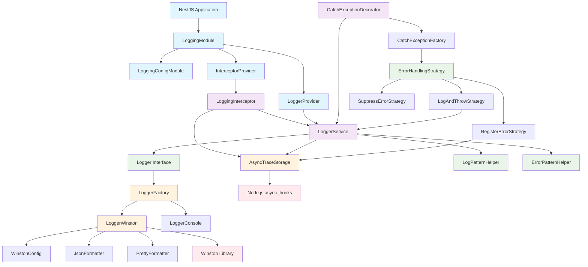
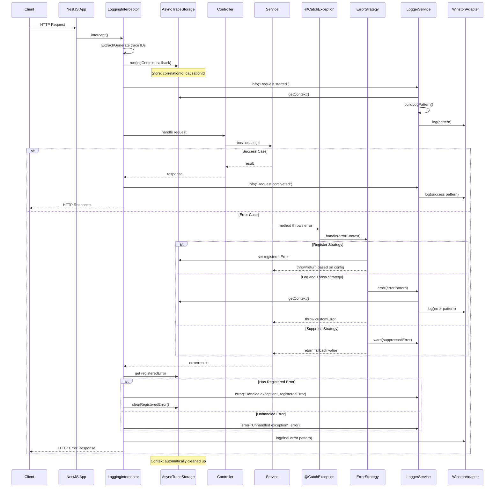

## 📁 **Diagrama de Arquivos e Pastas**

```
src/
├── core/                                    # 🎯 Domain Layer (Business Logic)
│   ├── interfaces/
│   │   ├── logger.interface.ts             # Contrato do logger
│   │   ├── logger-service.interface.ts     # Contrato do service
│   │   ├── error-handling-strategy.interface.ts  # Strategy para errors
│   │   └── index.ts
│   ├── enums/
│   │   ├── log-level.enum.ts              # Níveis de log
│   │   ├── error-handling-type.enum.ts    # Tipos de error handling
│   │   └── index.ts
│   ├── strategies/
│   │   ├── register-error.strategy.ts      # Strategy para registrar erros
│   │   ├── log-and-throw.strategy.ts       # Strategy para log + throw
│   │   ├── suppress-error.strategy.ts      # Strategy para suprimir erros
│   │   └── index.ts
│   └── helpers/
│       ├── get-log-pattern.helper.ts       # Helper para pattern de log
│       ├── get-error-pattern.helper.ts     # Helper para pattern de erro
│       ├── get-log-params.helper.ts        # Helper para params de log
│       └── index.ts
│
├── infrastructure/                          # 🔧 Infrastructure Layer
│   ├── context/
│   │   ├── async-trace-storage.service.ts  # AsyncLocalStorage management
│   │   └── index.ts
│   ├── winston/
│   │   ├── logger-winston.adapter.ts       # Winston adapter
│   │   ├── winston-config.interface.ts     # Configurações Winston
│   │   └── index.ts
│   ├── factories/
│   │   ├── logger.factory.ts               # Factory para loggers
│   │   ├── catch-exception.factory.ts      # Factory para exception handling
│   │   └── index.ts
│   ├── formatters/
│   │   ├── json.formatter.ts               # Formatter JSON
│   │   ├── pretty.formatter.ts             # Formatter pretty print
│   │   └── index.ts
│
├── application/                             # 🚀 Application Layer
│   ├── services/
│   │   ├── logger.service.ts               # Serviço principal de logging
│   │   └── index.ts
│   ├── decorators/
│   │   ├── catch-exception.decorator.ts    # Decorator principal
│   │   ├── log-method.decorator.ts         # Decorator para métodos
│   │   └── index.ts
│
├── nest/                                    # 🏠 NestJS Integration Layer
│   ├── interceptors/
│   │   ├── logging.interceptor.ts          # Interceptor global NestJS
│   │   ├── logging-config.interface.ts     # Configurações do interceptor
│   │   └── index.ts
│   ├── modules/
│   │   ├── logging.module.ts               # Módulo principal
│   │   ├── logging-config.module.ts        # Módulo de configuração
│   │   └── index.ts
│   ├── providers/
│   │   ├── logger.provider.ts              # Provider do logger
│   │   ├── interceptor.provider.ts         # Provider do interceptor
│   │   └── index.ts
│   └── constants/
│       ├── injection-tokens.ts             # Tokens de injeção
│       └── index.ts
│
├── types/                                   # 📝 Type Definitions
│   ├── dtos/
│   │   ├── log-pattern.dto.ts              # DTOs de patterns
│   │   ├── error-pattern.dto.ts            # DTOs de erro
│   │   ├── trigger.dto.ts                  # DTOs de trigger
│   │   └── index.ts
│   ├── options/
│   │   ├── catch-exception-options.type.ts # Opções do decorator
│   │   ├── logging-options.type.ts         # Opções de logging
│   │   └── index.ts
│   └── index.ts
│
├── utils/                                   # 🛠️ Utilities
│   ├── metadata.util.ts                    # Utilitários de metadata
│   ├── stack-trace.util.ts                 # Utilitários de stack trace
│   └── index.ts
│
└── index.ts                                # 📦 Main Export File
```

## 🔗 **Diagrama de Dependências**



## 🌊 **Fluxograma de Dados - Request Lifecycle**



## 📋 **Sprint Planning - Tasks Breakdown**

### 🏃‍♂️ **Sprint 3: NestJS Integration & Decorators (8-10 dias)**

#### **Epic 3.1: NestJS Interceptor**

- **LGR-013** 🎪 Implement configurable LoggingInterceptor

  - Estimativa: 4 dias
  - Prioridade: Critical
  - Dependências: LGR-008, LGR-004
  - AC: Interceptor com configurações forRoot funcionando

- **LGR-014** 🧪 Integration tests for interceptor
  - Estimativa: 2 dias
  - Prioridade: High
  - Dependências: LGR-013
  - AC: Tests E2E do interceptor com diferentes configurações

#### **Epic 3.2: Exception Decorator**

- **LGR-015** 🎭 Implement @CatchException decorator

  - Estimativa: 3 dias
  - Prioridade: Critical
  - Dependências: LGR-012
  - AC: Decorator funcionando com builder e estratégias

- **LGR-016** ✅ Implement decorator validation system
  - Estimativa: 1 dia
  - Prioridade: Medium
  - Dependências: LGR-015
  - AC: Validação de configurações conflitantes

---

### 🏃‍♂️ **Sprint 5: NestJS Modules & Integration (5-7 dias)**

#### **Epic 5.1: NestJS Modules**

- **LGR-021** 🏠 Create LoggingModule with providers

  - Estimativa: 3 dias
  - Prioridade: Critical
  - Dependências: LGR-013, LGR-015
  - AC: Módulo exportando todos os services corretamente

- **LGR-022** ⚙️ Implement LoggingConfigModule.forRoot()
  - Estimativa: 2 dias
  - Prioridade: High
  - Dependências: LGR-021
  - AC: Configuração dinâmica do módulo funcionando

#### **Epic 5.2: Final Integration**

- **LGR-023** 🔗 Integration tests E2E complete flow
  - Estimativa: 2 dias
  - Prioridade: High
  - Dependências: LGR-022
  - AC: Teste completo request -> interceptor -> decorator -> log

---

### 🏃‍♂️ **Sprint 6: Documentation (4-5 dias)**

#### **Epic 6.2: Documentation**

- **LGR-025** 📚 Complete API documentation
  - Estimativa: 2 dias
  - Prioridade: High
  - Dependências: LGR-023
  - AC: README, API docs, examples de uso
